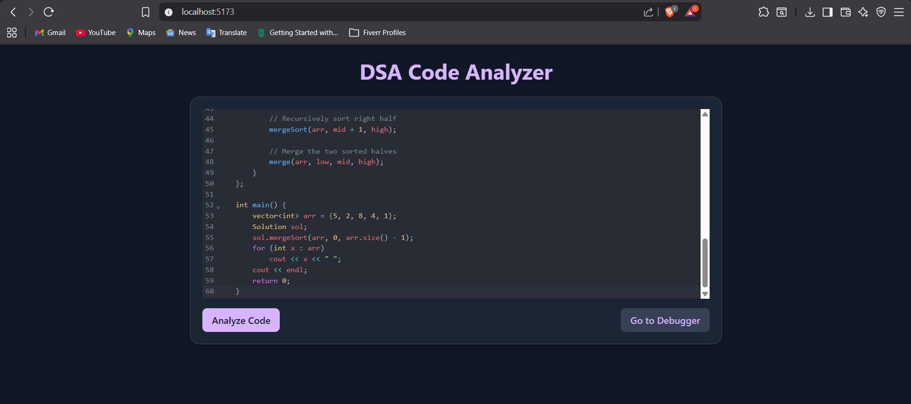
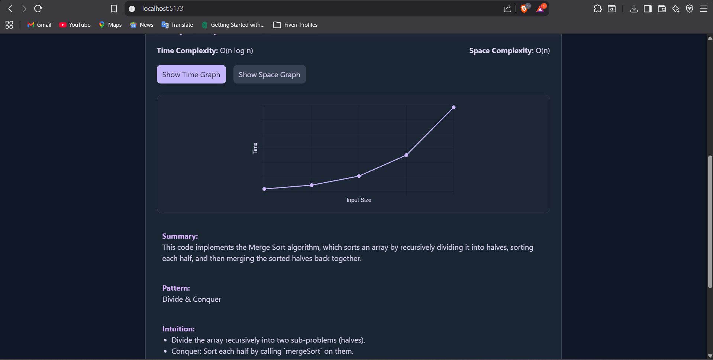

# 🧠 DSA Analyzer

A **Full Stack Web Application** designed to help users analyze, visualize, and track their progress in Data Structures and Algorithms (DSA) problems.  
This project integrates a **Spring Boot backend** and a **React frontend** to provide a smooth, data-driven user experience.

---

## 🚀 Tech Stack

**Frontend:** React, Axios, Tailwind CSS  
**Backend:** Spring Boot, Java, REST APIs  
**Database:** MySQL / MongoDB (configurable)  
**Build Tools:** Maven, npm  

---

## ⚙️ Setup Instructions

### 🖥️ Backend (Spring Boot)
1. Clone the repository:
   ```bash
   git clone https://github.com/your-username/dsa-analyzer.git
   cd dsa-analyzer/backend
   ```
2. Configure your database connection and API key in:
   ```
   src/main/resources/application.properties
   ```
   Example:
   ```properties
   spring.datasource.url=jdbc:mysql://localhost:3306/dsa_analyzer
   spring.datasource.username=root
   spring.datasource.password=yourpassword
   external.api.key=YOUR_API_KEY_HERE
   ```

3. Run the backend server:
   ```bash
   mvn spring-boot:run
   ```
   The backend runs on **http://localhost:8080**

---

### 🌐 Frontend (React)
1. Navigate to the frontend folder:
   ```bash
   cd ../frontend
   ```
2. Install dependencies:
   ```bash
   npm install
   ```
3. Start the frontend:
   ```bash
   npm start
   ```
   The frontend runs on **http://localhost:5173**

---

## Screenshots



--- 

## 🔄 CORS Configuration

CORS is **enabled by default** in the backend to allow communication with the React app:
```java
@CrossOrigin(origins = "http://localhost:5173")
```
If your frontend runs on a different port or domain, update this setting in your controller or global CORS configuration file.

---

## 🧩 Project Structure

```
DSA-Analyzer/
│
├── backend/
│   ├── src/main/java/com/dsa/analyzer/
│   ├── src/main/resources/
│   └── pom.xml
│
├── frontend/
│   ├── src/
│   ├── public/
│   └── package.json
│
└── README.md
```

---

## ✅ Requirements

- Java 17+
- Node.js 18+
- Gemini API Key
- Internet connection for API requests

---

## 🧠 Features

- DSA problem classification by topic & difficulty
- Visualization of problems
- Integration with debugger inside
- Real-time analysis of the code

---

## 🩵 Troubleshooting

| Issue | Possible Cause | Solution |
|-------|----------------|-----------|
| ❌ `CORS error` | Frontend unable to reach backend | Ensure backend CORS is enabled and both servers are running |
| ⚠️ `API key not found` | Key missing in `application.properties` | Add a valid key under `external.api.key` |
| 🔄 `Frontend not updating` | Cache issue | Stop server, run `npm run build` and restart |
| 🌐 `Backend not accessible` | Port conflict | Change port in `application.properties` |

---

## 🧰 Best Practices

- Keep your `application.properties` file secure and **never commit API keys**.
- Run both backend (`8080`) and frontend (`5173`) servers simultaneously.
- Use environment variables for production deployment.

---
